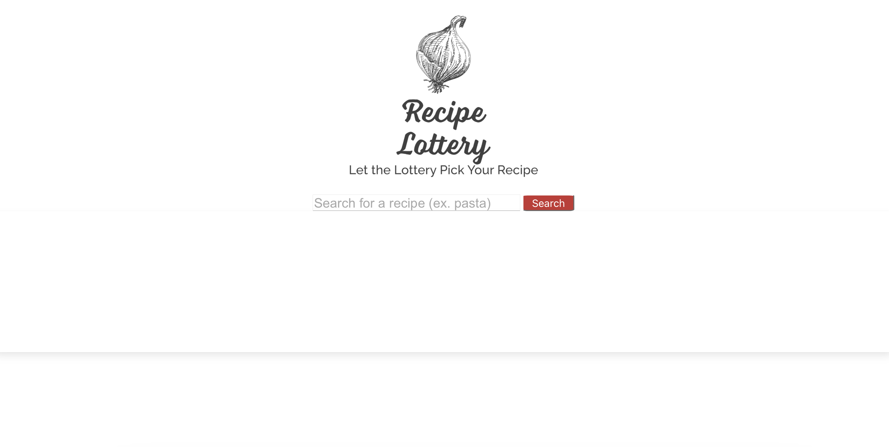

# The Recipe Lottery

## Overview

Four Bootcamp students came together to work on an application that would allow users to 
enter an ingredient that would then generate a random recipe.

## User Story

```
AS A user
I WANT to focus on an ingredient to elevate
SO THAT I can let the AI generate inspiration for me with a random recipe
```


## Acceptance Criteria

```
GIVEN I need to find a spontaneous recipe
WHEN I type in a certain ingredient and click the "Search" button
THEN I am presented with a unique recipe
WHEN I am in need of another recipe for the same ingredient
THEN I click the "Search" button again
WHEN I find a recipe that I like
THEN I save all the recipes
```

## Sneak Peek 

The screenshot below is a sneak peek of the application.



## Link to Page
